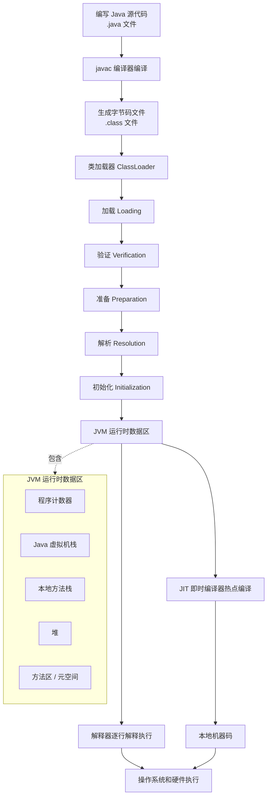
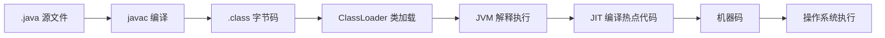

# Java 程序运行流程图

## 总览流程

## 简化记忆版

## 关键阶段说明

| 阶段 | 作用 | 面试表达 |
| --- | --- | --- |
| 编写源码 | 开发者编写 `.java` 文件 | Java 源码不能直接运行，需要先编译成字节码 |
| 编译 | `javac` 将 `.java` 编译为 `.class` | `.class` 是平台无关的字节码文件 |
| 类加载 | `ClassLoader` 把字节码加载进 JVM | 类加载过程包括加载、验证、准备、解析、初始化 |
| 运行时数据区 | JVM 为程序运行分配内存区域 | 常见区域有程序计数器、虚拟机栈、本地方法栈、堆、方法区/元空间 |
| 解释执行 | 解释器逐条执行字节码 | 启动快，但长期执行热点代码效率不如机器码 |
| JIT 编译 | 即时编译器把热点字节码编译成本地机器码 | 这就是 Java “编译与解释并存” 的重要原因 |
| 操作系统执行 | CPU 执行最终机器指令 | JVM 屏蔽了不同操作系统和硬件差异 |

## 一句话总结

Java 程序先由 `javac` 编译成平台无关的 `.class` 字节码，再由 JVM 通过类加载机制加载到内存中，运行时由解释器执行，并把热点代码交给 JIT 编译成本地机器码执行，从而兼顾跨平台能力和运行性能。
